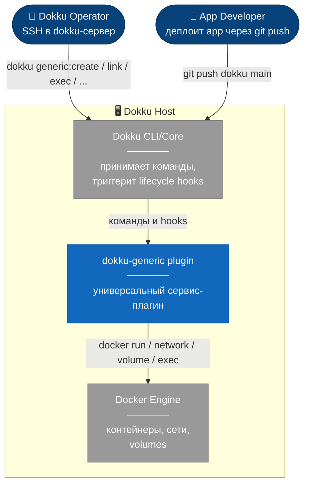
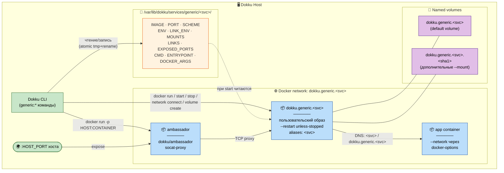
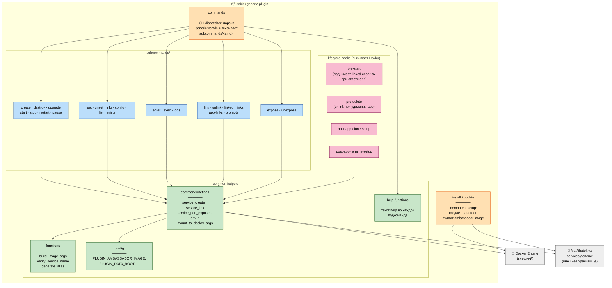
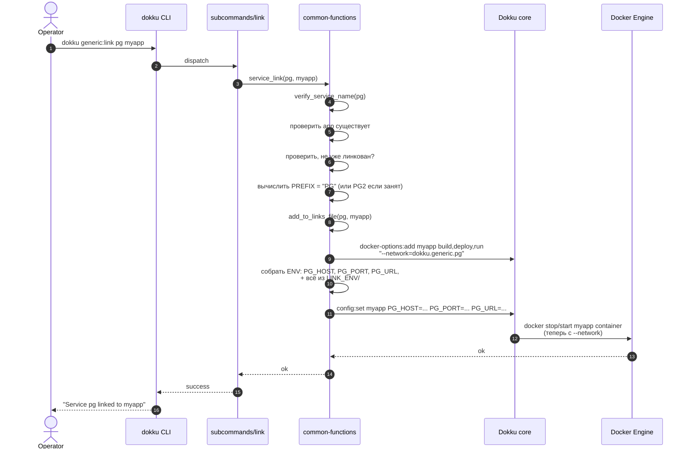

# dokku-generic — универсальный плагин Dokku для произвольных Docker-образов

**Дата:** 2026-05-06
**Статус:** утверждён, готов к плану реализации
**Источник дизайна:** dokku-redis (за основу взята структура и lifecycle-паттерны)

## 1. Цель и контекст

Плагин позволяет запускать **любой Docker-образ** как сервис Dokku с симметричным интерфейсом к существующим плагинам (`dokku-postgres`, `dokku-redis` и пр.):

- Создание/управление жизненным циклом контейнера (start/stop/restart/destroy).
- Передача env-переменных в контейнер сервиса.
- Монтирование томов (named/bind/custom) внутрь контейнера.
- Линковка с приложениями Dokku — автоматический проброс DNS-имени и переменных в config app.
- Экспоуз портов наружу хоста через ambassador-контейнер.
- Доступ внутрь контейнера: `enter` (shell) и `exec` (произвольная команда).
- Override команды и entrypoint, передача произвольных аргументов `docker run`.

**Только фоновые сервисы** (`--restart unless-stopped`). Для одноразовых задач у Dokku есть `dokku run`.

**Не поддерживается** (out of scope): backup/restore (Redis-специфичная семантика BGSAVE/RDB); clone/import/export; "connect"-команды специфичные к протоколу образа.

## 2. Архитектура и структура репозитория

**Имя плагина:** `dokku-generic`. **Префикс команд:** `generic`. Папка проекта переименовывается из `dokku-imageplugin` в `dokku-generic`.

**Имена Docker-ресурсов на сервис `<service>`:**
- Контейнер сервиса: `dokku.generic.<service>` (= name = hostname).
- Network: `dokku.generic.<service>` (отдельная user-defined bridge на каждый сервис — для изоляции линковки).
- Network alias: `<service>` (короткое имя дополнительно к полному).
- Default named volume: `dokku.generic.<service>` (для первого `--mount` без явного источника).
- Дополнительный named volume для `<container_path>` без явного источника: `dokku.generic.<service>.<sha1(path)[:12]>`.
- Ambassador (если есть expose): `dokku.generic.<service>.ambassador`.

**Структура файлов:**

```
dokku-generic/
├── plugin.toml                  # name=generic, type=service, version
├── Dockerfile                   # для CI-окружения (Dokku в контейнере)
├── Makefile                     # build/test/lint/release/act-*
├── README.md                    # документация + 3 MCP-примера + command reference
├── LICENSE.txt
├── .editorconfig
├── .gitignore
├── .actrc                       # конфиг для локального act
├── .github/workflows/ci.yml     # lint + tests, совместимый с act
├── .github/workflows/tagged-release.yml
├── install                      # установочный скрипт (idempotent)
├── update -> install            # симлинк
├── commands                     # CLI-диспатчер: парсит первый аргумент → subcommand
├── common-functions             # generic helper-функции (service_*, env_*, mount_*, ...)
├── functions                    # маленькие плагин-специфичные хелперы (build_image_args, ...)
├── help-functions               # help-текст для каждой подкоманды
├── config                       # дефолты переменных окружения плагина
├── service-list                 # для интеграции с `dokku ls`
├── pre-start                    # lifecycle hook: поднимает linked сервисы при старте app
├── pre-delete                   # lifecycle hook: unlink при удалении app
├── post-app-clone-setup
├── post-app-rename-setup
├── subcommands/
│   ├── create
│   ├── destroy
│   ├── exists
│   ├── list
│   ├── info
│   ├── config
│   ├── set
│   ├── unset
│   ├── upgrade
│   ├── clone
│   ├── rename
│   ├── start
│   ├── stop
│   ├── restart
│   ├── pause
│   ├── enter
│   ├── exec
│   ├── logs
│   ├── link
│   ├── unlink
│   ├── linked
│   ├── links
│   ├── app-links
│   ├── promote
│   ├── expose
│   └── unexpose
├── tests/
│   ├── test_helper.bash         # generic ассерты (копия из dokku-redis)
│   ├── setup-dokku.sh           # поднимает Dokku в Docker для integration-тестов
│   ├── shellcheck-exclude
│   ├── unit_helpers.bats
│   ├── service_create.bats
│   ├── service_destroy.bats
│   ├── service_exists.bats
│   ├── service_list.bats
│   ├── service_info.bats
│   ├── service_config.bats
│   ├── service_set.bats
│   ├── service_unset.bats
│   ├── service_upgrade.bats
│   ├── service_clone.bats
│   ├── service_rename.bats
│   ├── service_start.bats
│   ├── service_stop.bats
│   ├── service_restart.bats
│   ├── service_pause.bats
│   ├── service_enter.bats
│   ├── service_exec.bats
│   ├── service_logs.bats
│   ├── service_link.bats
│   ├── service_unlink.bats
│   ├── service_linked.bats
│   ├── service_links.bats
│   ├── service_app-links.bats
│   ├── service_promote.bats
│   ├── service_expose.bats
│   ├── service_unexpose.bats
│   ├── link_networks.bats
│   ├── hook_pre_start.bats
│   ├── hook_pre_delete.bats
│   ├── hook_post_app_clone_setup.bats
│   └── hook_post_app_rename_setup.bats
└── tmp/                         # рабочая папка, в .gitignore (включая tmp/dokku-redis для референса)
```

**Архитектурный подход** — гибрид: каркас и lifecycle-паттерны от dokku-redis (`plugin.toml`, `Dockerfile`, `install`, структура `subcommands/`, generic helper-функции из `common-functions`), подкоманды переписываются с нуля под универсальный образ. Redis-специфичный код (backup/clone/import/export/connect) выкидывается полностью.

## 3. Command surface

### 3.1 Жизненный цикл сервиса

```bash
dokku generic:create <service> <image[:tag]> [флаги]
```
Флаги (все повторяемые, кроме `--port`/`--scheme`/`--cmd`/`--entrypoint`/`--no-start`):

| Флаг | Описание |
|---|---|
| `--port N` | Порт внутри контейнера для линка/экспоуза. Опционален. |
| `--scheme STR` | Схема в `<PREFIX>_URL`. Default `tcp`. |
| `--env KEY=VALUE` | Env-переменная самого контейнера. |
| `--link-env KEY=VALUE` | Доп. переменная, прокидываемая в линкуемые apps. |
| `--mount SPEC` | Том. Форматы: `/container/path`, `/host/path:/container/path`, `name:/container/path[:ro\|rw]`. |
| `--expose H:C` | Сразу пробрасывает порт через ambassador. |
| `--cmd "..."` | CMD-override (идёт после image в `docker run`). |
| `--entrypoint /path/to/bin` | Entrypoint-override. |
| `--docker-arg ARG` | Произвольный аргумент к `docker run` (`--user=1000:1000`, `--cap-add=...`). |
| `--no-start` | Создать state, не запускать. |

```bash
dokku generic:destroy <service> [-f|--force]
```
Блокируется при наличии активных links (`Cannot delete linked service: <list>`). Без `-f` запрашивает подтверждение через ввод имени сервиса в TTY (точно как у dokku-redis):
```
WARNING: Potentially Destructive Action
This command will destroy <service> generic service.
To proceed, type "<service>"
> <service>
```
Удаляет: контейнер сервиса, ambassador (если есть), все named volumes сервиса, docker network, state-каталог.

```bash
dokku generic:exists <service>          # exit 0 если есть, 1 если нет
dokku generic:list                      # таблица всех generic-сервисов
dokku generic:info <service> [--<flag>] # --image, --status, --port, --internal-ip, --links, --exposed-ports
dokku generic:config <service>          # все ENV + LINK_ENV + MOUNTS + scheme + port
```

```bash
dokku generic:clone <source> <new> [--copy-volumes] [флаги override]
```
Копирует state-каталог `<source>` → `<new>` и создаёт новый сервис. По умолчанию **только конфиг** (image, port, scheme, ENV, LINK_ENV, MOUNTS-метаданные, CMD/ENTRYPOINT/DOCKER_ARGS). Volumes у нового сервиса — пустые named volumes с новыми именами. Linked apps **не клонируются** (новый сервис ни к кому не привязан). Любой флаг из `create` можно передать как override для нового сервиса (например, `--env PORT=5433`).

С флагом `--copy-volumes` дополнительно копируются данные всех named volumes старого сервиса в новые через временный контейнер `busybox` (`docker run --rm -v old:/from -v new:/to busybox cp -a /from/. /to/`). Bind-mount хост-путей **не копируются** (хост-пути shared, не имеют смысла копироваться).

Алгоритм:
1. Проверить `<new>` не существует.
2. `cp -a state/<source>/ state/<new>/`.
3. Очистить `state/<new>/LINKS` и `state/<new>/EXPOSED_PORTS` (новый сервис без линков/экспоузов).
4. Применить override-флаги к state/<new>/.
5. Создать новую сеть `dokku.generic.<new>`.
6. Создать новые named volumes (с именами от `<new>`).
7. Если `--copy-volumes`: для каждого named volume старого → busybox copy в новый.
8. Стартовать контейнер `<new>` (если у `<source>` не было `--no-start`-маркера).

```bash
dokku generic:rename <old> <new>
```
Переименовывает сервис. Включает: остановку контейнера, перенос state, пересоздание network/volumes, копирование данных, обновление **всех linked apps** (новые имена в docker-options и переменных окружения), удаление старых ресурсов, запуск с новым именем.

Алгоритм:
1. Проверить `<new>` не существует.
2. Записать список linked apps из `state/<old>/LINKS` (`old_links`).
3. Stop старого контейнера (если запущен).
4. `mv state/<old>/ state/<new>/`.
5. Создать новую сеть `dokku.generic.<new>`.
6. Создать новые named volumes с именами от `<new>`.
7. Скопировать данные всех named volumes старого → новые (busybox), bind-mount хост-пути остаются как есть.
8. Удалить старый контейнер (`docker rm dokku.generic.<old>`).
9. Удалить старую сеть (`docker network rm dokku.generic.<old>`).
10. Удалить старые named volumes.
11. Стартовать новый контейнер.
12. Для каждого app в `old_links`:
    - В `docker-options`: убрать `--network=dokku.generic.<old>`, добавить `--network=dokku.generic.<new>`.
    - В config app: удалить `<OLD_PREFIX>_HOST/PORT/URL` и переменные старого `LINK_ENV`, добавить переменные с новым префиксом и текущим `LINK_ENV` сервиса.
    - Триггерит рестарт app (по правилам `dokku config:set`).

Если на любом шаге происходит ошибка после шага 4 (state переименован) — операция останавливается, в логах указывается на каком шаге упало. Откат вручную возможен через `mv state/<new>/ state/<old>/` и пересоздание контейнера. Не делаем автоматический rollback — он сложнее самой операции.

Если ambassador был активен у `<old>` — он удаляется на шаге 8 (как часть старого контейнера-окружения), и пересоздаётся для `<new>` если есть `EXPOSED_PORTS` в state.

### 3.2 Изменение конфигурации

```bash
dokku generic:set <service> <те же флаги что у create, кроме --no-start>
dokku generic:unset <service> --env KEY [--link-env KEY] [--mount SPEC] [--expose H:C]
dokku generic:upgrade <service> <new-image[:tag]>     # alias к set --image
```

**Семантика:** `set`/`unset`/`upgrade` всегда **рестартует** сервис, если он был запущен. Изменения сохраняются в state атомарно (write-to-tmp + rename) **до** рестарта. Если в одном вызове `set` передано несколько флагов (например `--image` + два `--env`) — все изменения применяются к state по порядку, рестарт **один в конце**. Если `set --image` указывает на отсутствующий локально образ — выполняется `docker pull` перед рестартом. Если рестарт упал — state остаётся в новом виде, exit 1 с сообщением `State updated, restart failed: <error>. Recover with: dokku generic:restart <service>`.

`expose`/`unexpose` рестартуют только ambassador, не сам сервис.

`link`/`unlink` — рестартуют app (через `dokku ps:restart`), не сервис.

### 3.3 Состояние контейнера

```bash
dokku generic:start <service>      # idempotent: no-op если running, docker start если stopped
dokku generic:stop <service>       # docker stop с timeout 10s (PLUGIN_STOP_TIMEOUT)
dokku generic:restart <service>    # stop + start с пересборкой args из state
dokku generic:pause <service>      # docker pause/unpause toggle
```

**Status маппинг** (вычисляется на лету из `docker container inspect`):

| Состояние Docker | `info --status` |
|---|---|
| state-каталога нет | `not exists` |
| state есть, контейнера нет | `created` |
| `running` | `running` |
| `exited` | `stopped` |
| `paused` | `paused` |
| `restarting` | `restarting` |

### 3.4 Доступ внутрь контейнера

```bash
dokku generic:enter <service>                          # interactive shell (bash → sh fallback)
dokku generic:exec <service> [-i] [-t] <cmd> [args...] # произвольная команда; exit code пробрасывается
dokku generic:logs <service> [-t] [-n N] [-f]          # хвост логов
```

`exec` без `-i`/`-t` — не-интерактивный (для скриптов). `enter` всегда `-it`.

### 3.5 Линковка с приложениями

```bash
dokku generic:link <service> <app> [--alias ALT_PREFIX]
dokku generic:unlink <service> <app>
dokku generic:linked <service>      # список app, к которым привязан сервис
dokku generic:links <app>           # список generic-сервисов, к которым привязан app
dokku generic:app-links <app>       # для каких app сервис primary (есть несколько одинаковых линков)
dokku generic:promote <service> <app>   # сделать линк primary (когда у app несколько линков)
```

**Логика `link`:**
1. Префикс переменных = `--alias` или uppercase имени сервиса (с `-`/`.` → `_`). Пример: `my-pg` → `MY_PG`.
2. Если уже есть `<PREFIX>_URL` в config app → сгенерировать альтернативный alias `<PREFIX>2`/`<PREFIX>3`/... (как у dokku-redis).
3. Записать app в `LINKS`-файл сервиса.
4. Добавить опцию `--network=dokku.generic.<service>` в `dokku docker-options` для phases `build,deploy,run` у app.
5. Сформировать переменные:
   - `<PREFIX>_HOST=dokku.generic.<service>` (всегда).
   - Если задан port: `<PREFIX>_PORT=<port>`, `<PREFIX>_URL=<scheme>://dokku.generic.<service>:<port>`.
   - Все ключи из `LINK_ENV/`-конфига сервиса (могут перекрыть автогенерированные при совпадении).
6. Записать в config app через `dokku config:set <app> <vars>` (триггерит рестарт app).

**Логика `unlink`:** обратные операции — удалить из `LINKS`, убрать из `docker-options`, удалить переменные из app config.

### 3.6 Экспоуз портов через ambassador

```bash
dokku generic:expose <service> <host_port>:<container_port> [--bind 0.0.0.0]
dokku generic:unexpose <service> <host_port>:<container_port>
```

При первом `expose` — стартует ambassador-контейнер `dokku.generic.<service>.ambassador` на образе `$PLUGIN_AMBASSADOR_IMAGE` (default `dokku/ambassador:0.8.2`), подключённый к сети `dokku.generic.<service>`, с `-p <host>:<container>`. При последующих `expose` — ambassador пересобирается через `docker stop + docker rm + docker run` с обновлённым набором `-p` (атомарность набора не критична: ambassador не хранит состояние). При `unexpose` последнего порта — ambassador удаляется (`stop + rm`). Сам сервисный контейнер не трогается ни в одном из сценариев.

## 4. Модель данных и хранилище состояния

**Все per-service данные в `/var/lib/dokku/services/generic/<service>/`:**

```
<service>/
├── IMAGE              # одна строка: postgres:15
├── PORT               # одна строка или пусто
├── SCHEME             # tcp (default) | postgres | redis | http | ...
├── CMD                # CMD-override
├── ENTRYPOINT         # entrypoint-override (или пусто)
├── DOCKER_ARGS        # по строке на --docker-arg
├── ENV                # один файл, KEY=VALUE по строкам, экранирование
├── LINK_ENV           # тот же формат — для проброса в линкуемые apps
├── MOUNTS             # по строке на маунт (формат docker -v)
├── EXPOSED_PORTS      # по строке: <host_port>:<container_port>
├── LINKS              # по строке на app
├── ID                 # docker container id (после старта; обновляется)
└── CREATED_AT         # ISO timestamp
```

### 4.1 Формат `ENV` / `LINK_ENV`

Один файл, по строке `KEY=VALUE`. Имя ключа: `^[A-Z_][A-Z0-9_]*$`. Значение экранируется:

| Символ | Замена |
|---|---|
| `\` | `\\` |
| LF (`\n`) | `\n` (литералы `\` и `n`) |
| CR (`\r`) | `\r` |

Первый `=` в строке — разделитель (в имени `=` запрещён регексом, поэтому однозначно).

**Helper-функции** в `common-functions`:
- `env_escape <value>` / `env_unescape <value>`
- `env_get <service> <env-file> <KEY>` → echoes unescaped value
- `env_set <service> <env-file> <KEY> <VALUE>` (atomic: tmp+rename)
- `env_unset <service> <env-file> <KEY>`
- `env_list <service> <env-file>` → список `KEY=VALUE` (escaped)
- `env_to_docker_args <service> <env-file>` → `-e KEY=VALUE -e KEY2=VALUE2 ...` с unescape

**Прокидывание в docker-контейнер:** через `-e KEY=VALUE` напрямую (а не `--env-file`), потому что `--env-file` не поддерживает многострочные значения.

**Прокидывание в линкуемое приложение:** через `dokku config:set <app> KEY=VALUE` (с unescaped значением). Сам Dokku хранит config app в своём формате.

### 4.2 Валидация имён

- Имя сервиса: `^[a-zA-Z][a-zA-Z0-9_-]*$`, длина 1–50. Точка запрещена (ломает Docker DNS). Проверяется в начале каждой подкоманды через `verify_service_name`.
- Имя ENV/LINK_ENV ключа: `^[A-Z_][A-Z0-9_]*$`.

### 4.3 Откат при неудаче `create`

Если `docker run` упал при `create`:
1. Удалить state-каталог.
2. Удалить созданные named volumes (`docker volume rm dokku.generic.<service>*`).
3. Удалить созданную сеть (`docker network rm dokku.generic.<service>`).
4. Exit 1 с понятной ошибкой.

## 5. Docker integration, networking, lifecycle hooks

### 5.1 Сборка `docker run`

```bash
docker container run \
  --name dokku.generic.<service> \
  --hostname dokku.generic.<service> \
  --restart unless-stopped \
  --label dokku=service \
  --label dokku.service=generic \
  --label dokku.generic.service=<service> \
  --network dokku.generic.<service> \
  --network-alias <service> \
  $(docker_args_from_state)        # содержимое DOCKER_ARGS, по строке = одно значение
  $(env_to_docker_args ENV)        # -e KEY=VALUE
  $(mount_to_docker_args MOUNTS)   # -v ...
  $([ -s ENTRYPOINT ] && echo --entrypoint $(cat ENTRYPOINT))
  -d \
  <image> \
  $(cat CMD)
```

### 5.2 Networking стратегия

**Сеть на сервис** `dokku.generic.<service>` (user-defined bridge).

- Создаётся при `create`, удаляется при `destroy`.
- Сервисный контейнер всегда в этой сети, `--network-alias <service>` даёт короткое DNS-имя.
- При `link <svc> <app>` → `dokku docker-options:add <app> build,deploy,run --network=dokku.generic.<svc>`. При следующем рестарте app получает доп. сеть и резолвит сервис по DNS-имени `dokku.generic.<svc>` (полное) или `<svc>` (alias).
- При `unlink` → `dokku docker-options:remove <app> ...`.
- App, линкованный к нескольким generic-сервисам, попадает во все соответствующие сети (Docker это поддерживает).
- Ambassador-контейнер в той же per-service сети.

**Изоляция:** сервис `pg` не видит `redis` если оба generic-плагин не линкованы друг к другу (нет общего канала). App видит только сервисы, к которым явно линкован.

### 5.3 Lifecycle hooks (в корне плагина)

`pre-start <app>`:
```
для каждого SERVICE в fn-services-list:
  если APP в SERVICE/LINKS и status(SERVICE) != running:
    service_start SERVICE
```
Решает проблему: после ребута хоста app может стартовать раньше сервиса.

`pre-delete <app>`:
```
для каждого SERVICE в fn-services-list:
  если APP в SERVICE/LINKS:
    remove_from_links_file SERVICE APP
    (config app не чистим — он удаляется вместе с app)
```

`post-app-clone-setup <old> <new>`:
```
для каждого SERVICE с <old> в LINKS:
  add_to_links_file SERVICE <new>
  скопировать соответствующие env-переменные в config <new>
  добавить --network=dokku.generic.<SERVICE> в docker-options <new>
```

`post-app-rename-setup <old> <new>`:
```
для каждого SERVICE с <old> в LINKS:
  заменить <old> на <new> в LINKS
  (сам Dokku переносит config и docker-options в рамках rename)
```

### 5.4 Скрипт `install` (idempotent)

```bash
#!/usr/bin/env bash
set -eo pipefail
mkdir -p /var/lib/dokku/services/generic
chown dokku:dokku /var/lib/dokku/services/generic
docker image inspect "$PLUGIN_AMBASSADOR_IMAGE" >/dev/null 2>&1 \
  || docker image pull "$PLUGIN_AMBASSADOR_IMAGE" >/dev/null
echo "dokku-generic plugin installed"
```

Никаких глобальных сетей/контейнеров — всё per-service создаётся в `create`. Симлинк `update -> install` запускает тот же скрипт при апгрейде плагина.

### 5.5 Error handling, summarised

- Все подкоманды exit 1 при ошибке через `dokku_log_fail` (в stderr).
- `service_exists` гард в начале каждой подкоманды (кроме `create`/`list`/`exists`).
- При `create` существующего имени → fail.
- При `link` несуществующего app → fail с подсказкой `dokku apps:create <app>`.
- При `link` уже линкованного → fail (`Already linked as ...`).
- При `set --image` отсутствующего образа → авто-pull.
- При неудаче `set` рестарта — state в новом виде, exit 1.

## 6. Тесты, CI, релизы

### 6.1 Уровни тестирования

**Static analysis:** `shellcheck` + `shfmt -d` на все bash-скрипты. Эксклюды в `tests/shellcheck-exclude`.

**Unit (без Dokku, в host-bash):** `tests/unit_helpers.bats` — функции без побочных эффектов (парсинг флагов, escape/unescape ENV, валидация имён, генерация sha1-имён volumes).

**Integration (на реальном Dokku):** один файл на каждую subcommand + hook. Тестовый образ `redis:7-alpine` (лёгкий, есть `redis-cli` для проверки связности). Каждый bats-тест: `setup → action → assertion → teardown` (с `destroy --force`). Список файлов и сценариев — в Section 2 (структура `tests/`).

### 6.2 CI через GitHub Actions, совместимо с `act`

`.github/workflows/ci.yml` — два jobs:

**lint** (быстрый):
```yaml
- shellcheck
- shfmt -d
- проверка plugin.toml
```

**tests** (медленный, матрица по версиям Dokku `v0.34.8` + `master`):
```yaml
- sysctl vm.max_map_count=262144
- make ci-setup        # ставит Dokku в Docker
- make ci-test         # bats integration
- upload-artifact tmp/test-results при failure
```

`.actrc`:
```
-P ubuntu-24.04=catthehacker/ubuntu:act-22.04
--container-daemon-socket /var/run/docker.sock
```

`Makefile` цели:
- `make lint` — shellcheck + shfmt локально.
- `make unit-tests` — bats unit_*.bats.
- `make integration-tests` — поднимает Dokku в Docker (через `tests/setup-dokku.sh`) и гоняет integration bats.
- `make act-lint` / `make act-tests` / `make act` — те же jobs через `act --privileged --bind`.
- `make test` — `lint + unit-tests + integration-tests` (для CI).
- `make release` — git-тэг по версии в `plugin.toml`.

### 6.3 Релизы

`.github/workflows/tagged-release.yml`:
```yaml
on:
  push:
    tags: ["*"]
jobs:
  release:
    runs-on: ubuntu-24.04
    steps:
      - uses: softprops/action-gh-release@v3
        with:
          generate_release_notes: true
          make_latest: "true"
```

Установка пользователями:
```bash
sudo dokku plugin:install https://github.com/<owner>/dokku-generic.git generic
```

### 6.4 README

Структура:
1. Описание (что это и зачем).
2. Установка.
3. Три примера на MCP-серверах:
   - **Atlassian MCP** (`ghcr.io/sooperset/mcp-atlassian:latest`) — env-токены, `--port`, link.
   - **Filesystem MCP** (`mcp/filesystem:latest`) — bind-mount хост-директории, `--cmd`, link.
   - **Postgres MCP** (`mcp/postgres:latest`) — `--docker-arg --network=dokku-postgres-<db>` для связи с существующим dokku-postgres, link.
4. Полный command reference (как у dokku-redis): по разделу на каждую подкоманду с описанием, флагами и примером.
5. Раздел "Differences from dokku-redis" — для пользователей, мигрирующих привычку.

## 7. C4-диаграммы

### 7.1 Level 1 — Context

Кто взаимодействует с плагином и через что.



### 7.2 Level 2 — Container (топология одного сервиса)

Что появляется в Docker, когда оператор делает `generic:create + expose + link <app>`.



### 7.3 Level 3 — Component (внутри плагина)

Что лежит в репе и кто что вызывает.



### 7.4 Sequence — `generic:link <svc> <app>`

Что именно происходит при линковке (типичный happy path).



## 8. Out of scope

Ниже перечислены вещи, **не входящие** в первую версию плагина. Если потребуется — добавятся отдельным циклом spec→plan.

- Backup/restore (`backup`, `backup-schedule`, `import`, `export`) — нет универсальной семантики для произвольного образа (БД использует свои dump-форматы; для произвольных volumes пользователь может бэкапить через `docker run --rm -v dokku.generic.<svc>:/data busybox tar -czf - /data`).
- Multi-replica / master-replica режимы (как у dokku-postgres) — образ-специфично.
- Web UI / health-check endpoint мониторинг — Dokku core не предоставляет, и мы не добавляем.
- Auto-pull при старте сервиса — нагрузим только при `set --image`.
- Поддержка docker swarm / kubernetes — Dokku сам только Docker.

## 9. Implementation notes

- **bats helpers:** `tests/test_helper.bash` копируется 1:1 из dokku-redis с заменой `PLUGIN_COMMAND_PREFIX=redis` → `generic`. Ассерты `assert_contains`, `assert_success`, `assert_failure` уже generic.
- **Конфликт alias при `link`:** если у app в config уже есть `<PREFIX>_URL` (от другого link с тем же именем сервиса), генерируется суффикс `2`, `3`, ... — итоговые переменные `<PREFIX>2_HOST/PORT/URL`. Алгоритм: в цикле инкремент пока в `dokku config:get <app>` есть совпадение. То же поведение, что и в `dokku-redis` (`service_alternative_alias` функция).
- **Порядок применения `set`:** один проход по флагам в порядке передачи, каждый флаг изменяет соответствующий файл в state атомарно. После всех изменений — один рестарт сервиса.
- **Ambassador при добавлении expose:** `docker stop + docker rm + docker run` с новым набором `-p`. Состояния у ambassador нет, рестарт безопасен.
- **`promote`:** меняет primary alias для app с двумя одинаковыми линками — переписывает в config app переменную с примарным префиксом без суффикса. Реализация — копия `service_promote` из dokku-redis с заменой URL-формирования на нашу схему (`<scheme>://<dns>:<port>`).

## 10. Приложение — эквиваленты из dokku-redis

| dokku-redis | dokku-generic | Комментарий |
|---|---|---|
| `redis:create lollipop` | `generic:create lollipop redis:7` | образ становится аргументом |
| `redis:set lollipop image-version 6.0.20` | `generic:upgrade lollipop redis:6.0.20` | или `set --image redis:6.0.20` |
| `redis:connect lollipop` | `generic:exec lollipop redis-cli` | универсальный exec вместо специализированного connect |
| `redis:link lollipop myapp` (`REDIS_URL=...`) | `generic:link lollipop myapp` (`LOLLIPOP_HOST/PORT/URL` + `LINK_ENV`) | префикс из имени сервиса, +кастомные через --link-env |
| `redis:expose lollipop 6379` | `generic:expose lollipop 6379:6379` | через ambassador, как у redis |
| `redis:clone lollipop new` | `generic:clone lollipop new [--copy-volumes]` | по умолчанию только конфиг, опционально с данными |
| — (нет аналога) | `generic:rename old new` | переносит state, данные volumes, обновляет linked apps |
| `redis:backup` и пр. | — | out of scope |
